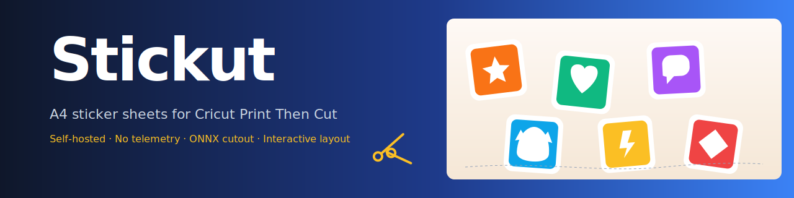

<div align="center">



[](https://github.com/sharkhunterr/stickut/releases)
[](https://hub.docker.com/r/sharkhunterr/stickut)
[](https://hub.docker.com/r/sharkhunterr/stickut)
[](LICENSE)

[](https://python.org)
[](https://fastapi.tiangolo.com)
[](https://reactjs.org)
[](https://typescriptlang.org)

**[Quick Start](#-quick-start)** •
**[Features](#-features)** •
**[Docker Hub](https://hub.docker.com/r/sharkhunterr/stickut)** •
**[Documentation](#-documentation)**

</div>

---

## ✂️ What is Stickut?

Stickut is a **self-hosted, no-telemetry** sticker sheet generator for **Cricut Print Then Cut** machines. Drop in any photo or pick from millions of online images, and Stickut detours the subject, adds a white cut contour, packs the stickers on the page size of your choice, and exports a 300 DPI PNG ready to import into Cricut Design Space.

Everything runs offline once the image is built — your photos never leave your machine.

> [!WARNING]
> **Vibe Coded Project** — This application was built **100% using AI-assisted development** with [Claude Code](https://claude.ai/code).

---

## ✨ Features

<table>
<tr>
<td width="50%" valign="top">

### 🖼️ Background removal pipeline
**Four ONNX models pre-baked**

- BiRefNet, ISNet, U²-Net, ISNet-Anime
- Hole-fill post-process for white-on-white subjects
- White contour at custom thickness (the cut line)
- Cache by content hash + model, indexed on disk

</td>
<td width="50%" valign="top">

### 🧩 Interactive A4 editor
**Drag, rotate, resize each sticker**

- Auto-pack with maxrects, then per-sticker overrides
- Undo / redo / reset to auto-pack
- Per-image duplicate count (×1 to ×99)
- Each copy independently positionable

</td>
</tr>
<tr>
<td width="50%" valign="top">

### 📐 Configurable sheet sizes
**Standard or custom**

- A4, A3, A5, A6, US Letter, US Legal
- **Cricut Print Then Cut mat (165 × 235 mm)**
- Business card, fully custom dimensions
- Live preview adapts to the page aspect ratio

</td>
<td width="50%" valign="top">

### 📦 Two export modes
**Composite or per-sticker**

- **Composite PNG @ 300 DPI** for direct Cricut PTC import
- **ZIP archive** with one PNG per sticker (rotation baked in), the frame separately, and `layout.json` metadata
- ZIP fits the Cricut "Sticker → Kiss Cut" workflow per-image

</td>
</tr>
<tr>
<td width="50%" valign="top">

### 🔍 Online image search (opt-in)
**Tabbed UI per provider**

- **Pixabay** (illustrations / vectors / photos, free key)
- **Iconify** (200k icons, no key)
- **Wikimedia Commons** (100M items, no key)
- **Openverse** (600M items, no key)
- All proxied through the backend; key never reaches the browser

</td>
<td width="50%" valign="top">

### 🎨 Decorative frames
**Optional, customisable**

- SVG templates with color + header-text injection
- Stickers auto-pack inside the `sticker_area` of the frame
- Replaceable via volume mount on `/app/templates`

</td>
</tr>
</table>

---

## 🚀 Quick Start

### Docker (recommended)

```yaml
services:
  stickut:
    image: sharkhunterr/stickut:latest
    container_name: stickut
    restart: unless-stopped
    ports:
      - "8000:8000"
    volumes:
      - ./cache:/app/cache
      - ./tmp:/app/tmp
    environment:
      - STICKUT_DEFAULT_MODEL=isnet-general-use
      - STICKUT_REMBG_WORKERS=1
      # Optional online search:
      # - STICKUT_ENABLE_SEARCH=true
      # - STICKUT_PIXABAY_API_KEY=your-key-here
```

```bash
docker compose up -d
```

Open <http://localhost:8000/>, drop images, adjust placement, export.

### From source

```bash
git clone https://github.com/sharkhunterr/stickut.git
cd stickut
docker compose up --build -d
```

First build downloads the four ONNX models (~700 MB) and takes 5–10 minutes.

---

## 🛠️ Technical Stack

| Layer | Technologies |
|---|---|
| **Backend** | Python 3.12, FastAPI, uvicorn, [rembg](https://github.com/danielgatis/rembg) (ONNX), Pillow, scipy, sse-starlette |
| **Frontend** | React 18, TypeScript 5, Tailwind CSS 3, Zustand, Vite |
| **Layout** | maxrects-packer + custom override + history (undo/redo), Canvas2D @ 300 DPI |
| **Export** | Native canvas PNG, fflate (ZIP), SVG injection |
| **DevOps** | Docker (multi-stage build), GitLab CI/CD, Docker Hub, GitHub mirror |

---

## 📚 Documentation

- 📥 [Installation Guide](docs/installation.md) — Docker, source, reverse proxy
- ⚙️ [Configuration Reference](docs/configuration.md) — env vars, models, search providers
- 🐳 [Docker Deployment](docs/docker.md) — production compose, volumes, sizing, troubleshooting

---

## 🚢 Release workflow

The release pipeline is GitLab-first with a GitHub mirror.

```bash
npm run release          # standard release (GitLab only)
npm run release:github   # release to both GitLab + GitHub
npm run release:full     # release to both + trigger Docker Hub deploy
```

Under the hood:

1. `standard-version` reads conventional commits → bumps `package.json`, `frontend/package.json`, `backend/pyproject.toml`, generates the `CHANGELOG.md` entry, creates the `vX.Y.Z` git tag.
2. `scripts/push.js` pushes the branch and the new tag to `origin` (GitLab) and optionally `github`.
3. The GitLab CI pipeline fires on the tag → builds the Docker image → pushes to Docker Hub → mirrors to GitHub → creates GitLab and GitHub releases from `GITHUB_RELEASES.md`.

GitLab CI/CD variables required:

| Variable | Purpose |
|---|---|
| `DOCKER_HUB_USER` | Docker Hub account (image will be `<user>/stickut`) |
| `DOCKER_HUB_TOKEN` | Docker Hub access token |
| `GITHUB_TOKEN` | PAT with `repo` scope, used for mirror push and release creation |
| `GITHUB_REPO` | e.g. `sharkhunterr/stickut` |
| `DEPLOY` | Set to `true` to trigger the deploy + release jobs (recommended on tag pipelines) |

---

## ⚠️ Known limitations

- **Cricut PTC max printable area** is ~165 × 235 mm (varies by model). Use the dedicated *Cricut Print Then Cut* page format in Stickut to avoid Cricut Design Space truncating your sheet.
- The **Sticker → Kiss Cut / Die Cut** menu in Cricut Design Space only appears when each sticker is uploaded as its own image. Use the **ZIP export** for that workflow.
- All processing is CPU-bound. First inference of `birefnet-general` takes 30–90 s. **`isnet-general-use` is the recommended default** at 3–6 s per image.

---

## 📜 License

MIT © sharkhunterr — see [LICENSE](LICENSE).
